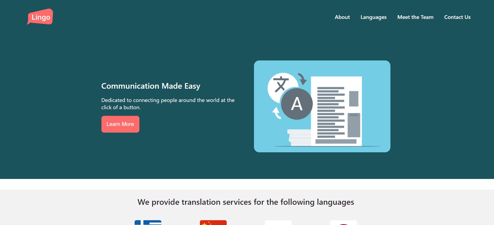

<!-- Improved compatibility of back to top link: See: https://github.com/othneildrew/Best-README-Template/pull/73 -->
<a name="readme-top"></a>
<!--
*** Thanks for checking out the Best-README-Template. If you have a suggestion
*** that would make this better, please fork the repo and create a pull request
*** or simply open an issue with the tag "enhancement".
*** Don't forget to give the project a star!
*** Thanks again! Now go create something AMAZING! :D
-->


<!-- PROJECT SHIELDS -->
<!--
*** I'm using markdown "reference style" links for readability.
*** Reference links are enclosed in brackets [ ] instead of parentheses ( ).
*** See the bottom of this document for the declaration of the reference variables
*** for contributors-url, forks-url, etc. This is an optional, concise syntax you may use.
*** https://www.markdownguide.org/basic-syntax/#reference-style-links
-->
[![Contributors][contributors-shield]][contributors-url]
[![Forks][forks-shield]][forks-url]
[![Stargazers][stars-shield]][stars-url]
[![Issues][issues-shield]][issues-url]


<!-- PROJECT LOGO -->
<br />
<div align="center">
  <a href="https://github.com/fac30/Best-Agency-Phoenix-Halimah">
  </a>

  <h3 align="center">Agency-Phoenix-Halimah</h3>

  <p align="center">
    <br />
    <a href="https://github.com/fac30/Best-Agency-Phoenix-Halimah"><strong>Explore the docs »</strong></a>
    <br />
    <br />
    <a href="https://github.com/fac30/Best-Agency-Phoenix-Halimah">View Demo</a>
    ·
    <a href="https://github.com/fac30/Best-Agency-Phoenix-Halimah/issues">Report Bug</a>
    ·
    <a href="https://github.com/fac30/Best-Agency-Phoenix-Halimah/issues">Request Feature</a>
  </p>
</div>


<!-- TABLE OF CONTENTS -->
<details>
  <summary>Table of Contents</summary>
  <ol>
    <li>
      <a href="#about-the-project">About The Project</a>
      <ul>
        <li><a href="#built-with">Built With</a></li>
      </ul>
    </li>
    <li>
      <a href="#getting-started">Getting Started</a>
      <ul>
        <li><a href="#prerequisites">Prerequisites</a></li>
        <li><a href="#installation">Installation</a></li>
      </ul>
    </li>
    <li><a href="#usage">Usage</a></li>
    <li><a href="#roadmap">Roadmap</a></li>
    <li><a href="#contributing">Contributing</a></li>
    <li><a href="#license">License</a></li>
    <li><a href="#contact">Contact</a></li>
    <li><a href="#acknowledgments">Acknowledgments</a></li>
  </ol>
</details>



# FAC30B Markup Module Project
Halimah and Phoenix's project for the markup module, designing a website for a translation agency.
Access Website here: https://fac30.github.io/Agency-Phoenix-Halimah/

## Core Stories 
### As a potential client, I want to:

- See information about each member of your team so that I can know who you are
- Browse your website on mobile, tablet, and desktop devices
- Click to navigate to different sections of your webpage
- Contact you to enquire about working with you
- Visit your website at a publicly accessible domain name

### Additionally, as a visually impaired user, I want to:

- Navigate your website using keyboard controls
- Hear my screen reader describe the content on your website


## Acceptance Criteria 
### User stories come with acceptance criteria - a detailed scope of a user’s requirements.

- Navigation menu
- ‘About us’ section
- Contact form
- A user cannot submit a form without filling out all of the mandatory fields (name, company name, email address)
- Information from the form doesn’t get submitted until the user clicks a button


<!-- ABOUT THE PROJECT -->
## About The Project

A translation agency website providing the best services available for a multitude of languages. Sign up with us now and let your translation worries dissappear!

Here's why:
* 30 years of experience in the field
* 24/7 support
* Flexible 


### Built With

This section should list any major frameworks/libraries used to bootstrap your project. Leave any add-ons/plugins for the acknowledgements section. Here are a few examples.


* [![JQuery][JQuery.com]][JQuery-url]
* 
* 
* 

<p align="right">(<a href="#readme-top">back to top</a>)</p>

<!-- GETTING STARTED -->
### Installation

If you want to install this project on your local machine as a template

1. Clone the repo
   ```sh
   git clone https://github.com/your_username_/Project-Name.git
   ```
2. Install NPM packages
   ```sh
   npm install
   ```

<p align="right">(<a href="#readme-top">back to top</a>)</p>

<!-- ROADMAP -->
## Roadmap

- [x] Add Changelog
- [x] Add back to top links
- [x] Website Structure
- [x] Contact form
- [x] Carousel
- [x] About us Page
- [x] Navbar
- [x] Employee Cards
- [ ] Allowing Tabbing throughout page


See the [open issues](https://github.com/othneildrew/Best-README-Template/issues) for a full list of proposed features (and known issues).

<p align="right">(<a href="#readme-top">back to top</a>)</p>


<!-- CONTRIBUTING -->
## Contributing

1. Fork the Project
2. Create your Feature Branch (`git checkout -b feature`)
3. Commit your Changes (`git commit -m 'Add some Feature'`)
4. Push to the Branch (`git push origin feature`)
5. Open a Pull Request

<p align="right">(<a href="#readme-top">back to top</a>)</p>


<!-- MARKDOWN LINKS & IMAGES -->
<!-- https://www.markdownguide.org/basic-syntax/#reference-style-links -->
[contributors-shield]: https://img.shields.io/github/contributors/fac30/Agency-Phoenix-Halimah?style=for-the-badge
[contributors-url]: https://github.com/fac30/Agency-Phoenix-Halimah/graphs/contributors
[forks-shield]: https://img.shields.io/github/forks/fac30/Agency-Phoenix-Halimah?style=for-the-badge
[forks-url]: https://github.com/fac30/Agency-Phoenix-Halimah/network/members
[stars-shield]: https://img.shields.io/github/stars/fac30/Agency-Phoenix-Halimah?style=for-the-badge
[stars-url]: https://github.com/fac30/Agency-Phoenix-Halimah/stargazers
[issues-shield]: https://img.shields.io/github/issues/fac30/Agency-Phoenix-Halimah?style=for-the-badge
[issues-url]: https://github.com/fac30/Agency-Phoenix-Halimah/issues
[product-screenshot]: images/screenshot.png
[Next.js]: https://img.shields.io/badge/next.js-000000?style=for-the-badge&logo=nextdotjs&logoColor=white
[Next-url]: https://nextjs.org/
[React.js]: https://img.shields.io/badge/React-20232A?style=for-the-badge&logo=react&logoColor=61DAFB
[React-url]: https://reactjs.org/
[Vue.js]: https://img.shields.io/badge/Vue.js-35495E?style=for-the-badge&logo=vuedotjs&logoColor=4FC08D
[Vue-url]: https://vuejs.org/
[Angular.io]: https://img.shields.io/badge/Angular-DD0031?style=for-the-badge&logo=angular&logoColor=white
[Angular-url]: https://angular.io/
[Svelte.dev]: https://img.shields.io/badge/Svelte-4A4A55?style=for-the-badge&logo=svelte&logoColor=FF3E00
[Svelte-url]: https://svelte.dev/
[Laravel.com]: https://img.shields.io/badge/Laravel-FF2D20?style=for-the-badge&logo=laravel&logoColor=white
[Laravel-url]: https://laravel.com
[Bootstrap.com]: https://img.shields.io/badge/Bootstrap-563D7C?style=for-the-badge&logo=bootstrap&logoColor=white
[Bootstrap-url]: https://getbootstrap.com
[JQuery.com]: https://img.shields.io/badge/jQuery-0769AD?style=for-the-badge&logo=jquery&logoColor=white
[JQuery-url]: https://jquery.com 
